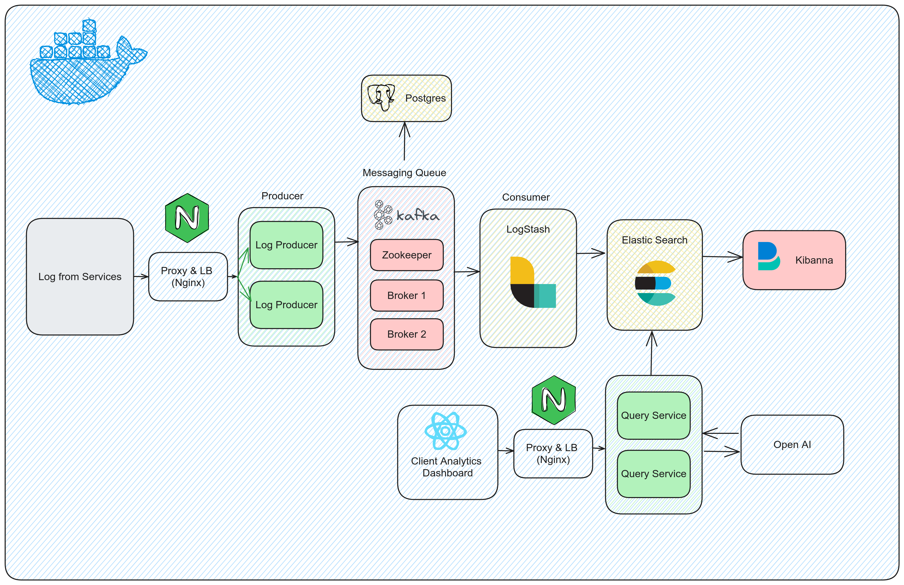

# 🔍Log Lens


- Welcome to Log Lens, a powerful log management system designed to efficiently handle vast volumes of log data. This project encompasses a robust log ingestor and a user-friendly query interface, providing seamless log analysis capabilities. The following guide will help you understand the project, run it successfully, and explore its features.

- Built for Dyte 2023 Assignment

<div style="text-align:center">
  
</div>

## Contents
1. [About Me](#-about-me)
5. [Prerequistes](#pre-requisites)
5. [Features Implemented](#-features-implemented)
6. [Demo Video](#-demo-video)
7. [Solution Architecture](#-solution-architecture)
8. [Technologies Used](#-technologies-used)
9. [Why this Architecture](#-why-this-architecture-stands-out-best)
10. [Benchmarking](#-benchmarking)
13. [How it Can be Improved Further](#-how-it-can-be-improved-further)
15. [Commit Histories](#-commit-histories)
16. [References Used](#-references-used)
17. [Note of Thanks](#-note-of-thanks)

# 👤 About Me

- Name: Devesh Meena
- Email: nothefakedevesh@gmail.com, meenadevesh2003@gmail.com
- Github Username: deveshXm
- LinkedIn: https://www.linkedin.com/in/devxm/
- University: National Institute of Technology, Jalandhar
# ⚙️ Features Implemented

- [x] Log Ingestor
- [x] Ability to send http response
- [x] Added Kafka, Logstash , elasticsearch, Postgres & Kibana
- [x] Highly scalable and fault tolerant 
- [x] Query Interface

# 🏛️ Proposed Architecture

  

## Components Overview

* ### Log Ingestion Layer

  - **Nginx:** Serves as the web server for handling HTTP log ingestion. Ensures secure and efficient transfer of logs into the system.

* ### Message Queue

  - **Kafka:** Implemented as a distributed event streaming platform to enable real-time processing and parallel ingestion of logs. Enhances fault tolerance and ensures data durability.

* ### Log Processing and Storage

  - **Logstash:** Ingests and processes logs from various sources, providing flexibility in log handling and transformation.

  - **Postgres:** Utilized as a relational database for structured storage of log data. Ensures data integrity through ACID compliance and supports complex queries.

  - **Elasticsearch:** Stores log data efficiently and facilitates powerful search and analysis capabilities. Integrated with Kibana for real-time visualization.

## Proposed Features

1. **Fault Tolerance:**
   - Distributed components and Kafka's replication ensure the system can continue functioning in the face of failures.
   - Database replication in Postgres enhances data availability and fault tolerance.

2. **Scalability:**
   - Elasticsearch and Kafka support horizontal scaling, allowing the system to handle increasing log volumes seamlessly.
   - Auto-scaling mechanisms can be implemented for ELK components to dynamically adapt to varying workloads.

3. **Real-time Processing:**
   - Kafka's event streaming platform enables parallel ingestion, reducing latency and providing real-time log processing.
   - Integration with Kibana allows users to visualize and analyze log data as it is ingested.

4. **Security:**
   - Implementation of SSL/TLS encryption for communication between components.
   - Robust access control mechanisms for Elasticsearch, Kafka, and Postgres to ensure data privacy.

5. **Monitoring and Logging:**
   - Centralized logging setup for comprehensive monitoring, debugging, and performance analysis.
   - Introduction of an alerting system for real-time notifications about critical events.

6. **Documentation and Knowledge Transfer:**
   - Enhancement of system documentation to provide detailed insights into architecture, deployment procedures, and troubleshooting steps.
   - Conducting training sessions for the operations and development teams to facilitate a deeper understanding of the technologies used.

7. **Containerization and Orchestration:**
   - Consideration of containerization using Docker for improved portability.
   - Exploration of orchestration tools such as Kubernetes for automated deployment, scaling, and management of containerized components.

- The proposed architecture aims to build upon the existing system's strengths, addressing areas for improvement and introducing features that enhance fault tolerance, scalability, and real-time processing. This comprehensive approach ensures the Log Ingestor and Querying System remains resilient, adaptable, and efficient in handling diverse log data. 

- Above arhitecture is suitable for handling more than 1 Million + users with being both fault tolerant and resilient.

# 🚀 Getting Started

### Prerequisites

This is an example of how to list things you need to use the software and how to install them.
* Node
* Docker
* Docker Compose

### Installation

_Below is an example of how you can instruct your audience on installing and setting up your app. This template doesn't rely on any external dependencies or services._

1. Get a free API Key at [https://example.com](https://example.com)
2. Clone the repo
   ```sh
   git clone https://github.com/dyte-submissions/november-2023-hiring-deveshXm.git

3. Start Docker Compose file
    ```
    docker compose up
    ```

<p align="right">(<a href="#readme-top">back to top</a>)</p>

<!-- USAGE EXAMPLES -->
## 🔄 Usage


1. Produce logs at http://localhost:3000/logs 
    ```
      curl -X POST \
      http://localhost:3000/logs \
      -H 'Content-Type: application/json' \
      -d '{
            "level": "info",
            "message": "Application started successfully",
            "resourceId": "server-5678",
            "timestamp": "2023-11-19T12:34:56Z",
            "traceId": "def-uvw-456",
            "spanId": "span-789",
            "commit": "a1b2c3d",
            "metadata": {
                "parentResourceId": "server-1234"
            }
          }'

    ```
  
2. Query into Elastic Search at http://localhost:3001
    ```
      GET http://localhost:3001/search?{Query Params}

    ```
    - ###  Query Params
      -  level
      -  message
      -  resourceId
      -  timestampStart
      -  timestampEnd
      -  traceId
      -  spanId
      -  commit
      -  parentResourceId

    - Example Request 
      ```bash
        GET http://localhost:3001/query?resourceId=server-1&timestampStart=2023-08-15T00:00:00Z&timestampEnd=2023-09-15T23:59:59Z`

4. Real Time log at Kibana

      ```
        http://localhost:5601/app/logs/stream?flyoutOptions=(flyoutId:!n,flyoutVisibility:hidden,surroundingLogsId:!n)&logFilter=(expression:%27%27,kind:kuery)&logPosition=(end:now,position:(tiebreaker:6,time:1700383920183),start:now-1d,streamLive:!f)
      ```
3. Access Dashboard UI at http://localhost:4173

 

<p align="right">(<a href="#readme-top">back to top</a>)</p>

## 🛠️ Technologies Used

  *     
  *     
  *     
  *       
  *    
  *       
  *     
  *   


### Frontend

| Technology Used                                  | Reason             |
| ------------------------------------------------ | ------------------ |
| [ReactJS](https://reactjs.org/)                  | UI Development     |
| [Vite](https://vitejs.dev/)                      | Fast Development   |
| [Tailwind CSS](https://tailwindcss.com/)         | Styling Efficiency |
| [Axios](https://axios-http.com/)                 | HTTP Requests      |

### Backend
| Technology Used                        | Reason                                                   |
| -------------------------------------- | -------------------------------------------------------- |
| [Node.js](https://nodejs.org/)         | Server-Side JavaScript and Backend Development           |
| [Express](https://expressjs.com/)      | Minimalist Web Application Framework for Node.js         |
| [PostgreSQL](https://www.postgresql.org/) | Robust Relational Database Management System            |
| [Elasticsearch](https://www.elastic.co/elasticsearch/) | Distributed Search and Analytics Engine          |
| [Kibana](https://www.elastic.co/kibana/) | Real Time Log Analysis |
| [Logstash](https://www.elastic.co/logstash/) | Data Processing and Ingestion Tool for Elasticsearch |
| [Pino](https://github.com/pinojs/pino) | Fast and Low Overhead Node.js Logger                     |
| [Apache Kafka](https://kafka.apache.org/) | Distributed Streaming Platform for Real-Time Data       |
| [Docker](https://www.docker.com/)      | Container Orchestration                                  |
| [NGINX](https://www.nginx.com/)        | Load Balancer and Web Server                             |


<!-- ### Backend
[](https://skillicons.dev) -->

## 🏆 Why this Architecure 


* ### Fault Tolerance

   **Distributed Components:** The use of ELK stack, Postgres, Nginx, and Kafka involves distributed components, contributing to fault tolerance. In the event of a failure in one component, the system can continue to function without a complete breakdown.

  **Kafka's Replication:** Kafka's replication capabilities ensure that log data is not lost even if one or more Kafka brokers experience failures. This redundancy enhances the overall fault tolerance of the system.

  **Data Integrity with Postgres:** Postgres, being ACID compliant, ensures data integrity even in the face of unexpected failures, preventing data corruption and loss.

* ### Scalability

  **Elasticsearch Scaling:** ELK stack's Elasticsearch is designed to scale horizontally, allowing the system to efficiently handle increased log volumes. As the data load grows, additional Elasticsearch nodes can be added to distribute the workload.

  **Kafka's Horizontal Scaling:** Kafka's distributed architecture supports horizontal scaling, enabling the system to handle growing traffic by adding more Kafka brokers. This ensures the scalability required for a log ingestion system.

* ### Real-time Processing

  **Kafka's Event Streaming:** Kafka's event streaming platform facilitates real-time processing of logs. It enables parallel ingestion of logs, reducing latency and ensuring that log data is available for analysis almost immediately.

  **Kibana Visualization:** The integration with Kibana in the ELK stack provides real-time visualization capabilities, allowing users to monitor and analyze log data as it is ingested.

* ### Data Integrity and Structured Storage

  **Postgres Relational Model:** Postgres is employed for its relational model, allowing for structured and organized storage of log data. This facilitates complex queries, joins, and ensures data integrity through ACID compliance.

  **Elasticsearch Search and Analysis:** Elasticsearch's powerful search and analysis capabilities contribute to efficient data retrieval, supporting a wide range of queries for effective log analysis.

* ### Conclusion

  The chosen architecture combines fault tolerance, scalability, and real-time processing to create a robust Log Ingestor and Querying System. By leveraging the strengths of ELK stack, Postgres, Nginx, and Kafka, the solution ensures data reliability, adaptability to changing workloads, and timely availability of log data for analysis.

## 📊 Benchmarking

For testing a Node.js application to assess its performance and scalability some of the tools that I can use are

1. Grafana K6

## 🔄 How it can be Improved Further


* ### Fault Tolerance

  **Distributed Components:** The use of ELK stack, Postgres, Nginx, and Kafka involves distributed components, contributing to fault tolerance. In the event of a failure in one component, the system can continue to function without a complete breakdown.

  **Kafka's Replication:** Kafka's replication capabilities ensure that log data is not lost even if one or more Kafka brokers experience failures. This redundancy enhances the overall fault tolerance of the system.

  **Data Integrity with Postgres:** Postgres, being ACID compliant, ensures data integrity even in the face of unexpected failures, preventing data corruption and loss.

* ### Scalability

  **Elasticsearch Scaling:** ELK stack's Elasticsearch is designed to scale horizontally, allowing the system to efficiently handle increased log volumes. As the data load grows, additional Elasticsearch nodes can be added to distribute the workload.

  **Kafka's Horizontal Scaling:** Kafka's distributed architecture supports horizontal scaling, enabling the system to handle growing traffic by adding more Kafka brokers. This ensures the scalability required for a log ingestion system.

* ### Real-time Processing

  **Kafka's Event Streaming:** Kafka's event streaming platform facilitates real-time processing of logs. It enables parallel ingestion of logs, reducing latency and ensuring that log data is available for analysis almost immediately.

  **Kibana Visualization:** The integration with Kibana in the ELK stack provides real-time visualization capabilities, allowing users to monitor and analyze log data as it is ingested.

* ### Data Integrity and Structured Storage

  **Postgres Relational Model:** Postgres is employed for its relational model, allowing for structured and organized storage of log data. This facilitates complex queries, joins, and ensures data integrity through ACID compliance.

  **Elasticsearch Search and Analysis:** Elasticsearch's powerful search and analysis capabilities contribute to efficient data retrieval, supporting a wide range of queries for effective log analysis.

* ### Conclusion

  The chosen architecture combines fault tolerance, scalability, and real-time processing to create a robust Log Ingestor and Querying System. By leveraging the strengths of ELK stack, Postgres, Nginx, and Kafka, the solution ensures data reliability, adaptability to changing workloads, and timely availability of log data for analysis.


<!-- ## 📝 Commit Histories -->

## 📖 References Used
- https://shivama205.medium.com/real-time-log-management-system-9a0258ca0516
- https://aircconline.com/ijcsea/V7N4/7417ijcsea02.pdf
- https://stackoverflow.com/questions/16192755/hybrid-db-system-nosql-for-data-sql-for-relationships-best-practice
- https://engineering.linkedin.com/distributed-systems/log-what-every-software-engineer-should-know-about-real-time-datas-unifying
- https://aws.amazon.com/blogs/architecture/designing-a-high-volume-streaming-data-ingestion-platform-natively-on-aws/
- [https://blog.devgenius.io/implementing-apache-kafka-and-docker-integration-a-comprehensive-guide-5c6872a37c77#:~:text=Here's how Docker Compose can,each broker to scale](https://blog.devgenius.io/implementing-apache-kafka-and-docker-integration-a-comprehensive-guide-5c6872a37c77#:~:text=Here%27s%20how%20Docker%20Compose%20can,each%20broker%20to%20scale%20horizontally) 
- [horizontally](https://blog.devgenius.io/implementing-apache-kafka-and-docker-integration-a-comprehensive-guide-5c6872a37c77#:~:text=Here%27s%20how%20Docker%20Compose%20can,each%20broker%20to%20scale%20horizontally).[https://medium.com/@anchan.ashwithabg95/fault-tolerance-in-apache-kafka-d1f0444260cf#:~:text=Fault tolerance in Kafka is,hold one or more partitions](https://medium.com/@anchan.ashwithabg95/fault-tolerance-in-apache-kafka-d1f0444260cf#:~:text=Fault%20tolerance%20in%20Kafka%20is,hold%20one%20or%20more%20partitions).
- https://medium.com/latentview-data-services/how-to-use-apache-kafka-to-guarantee-message-ordering-ac2d00da6c22
- https://elastic-stack.readthedocs.io/en/latest/e2e_kafkapractices.html
- https://www.elastic.co/blog/getting-started-with-the-elastic-stack-and-docker-compose-part-2